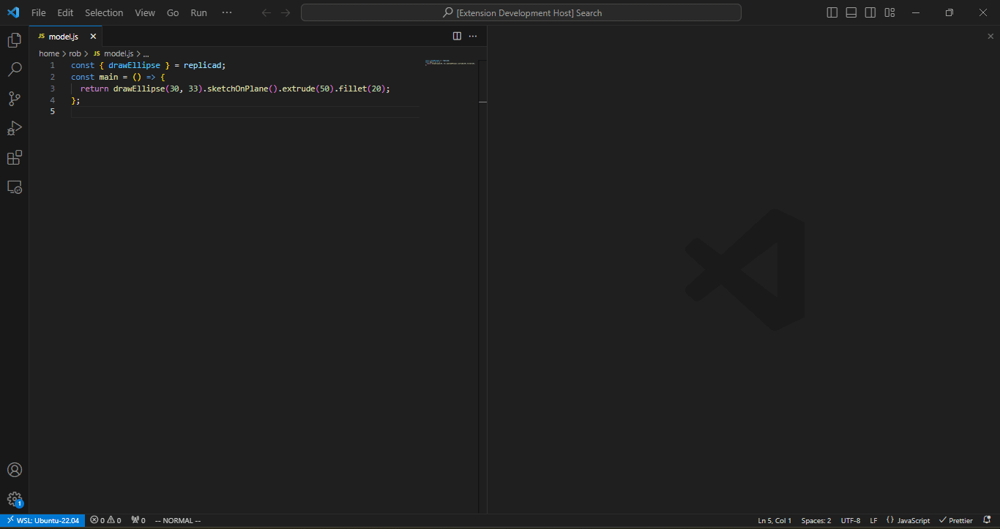

# Replicad Viewer VSCode Extension

> Live preview for your CAD models with [replicad](https://replicad.xyz/) scripts in VSCode!

## Features

While editing your script, open the command palette with `CTRL + SHIFT + P` and
run `Open Replicad Visualiser`. This will open up a new panel much like the Markdown live preview:

## Requirements

None.

## Extension Settings

None.

## Known Issues

None.

## Release Notes

### 0.0.1

Initial release with working visualiser pane
